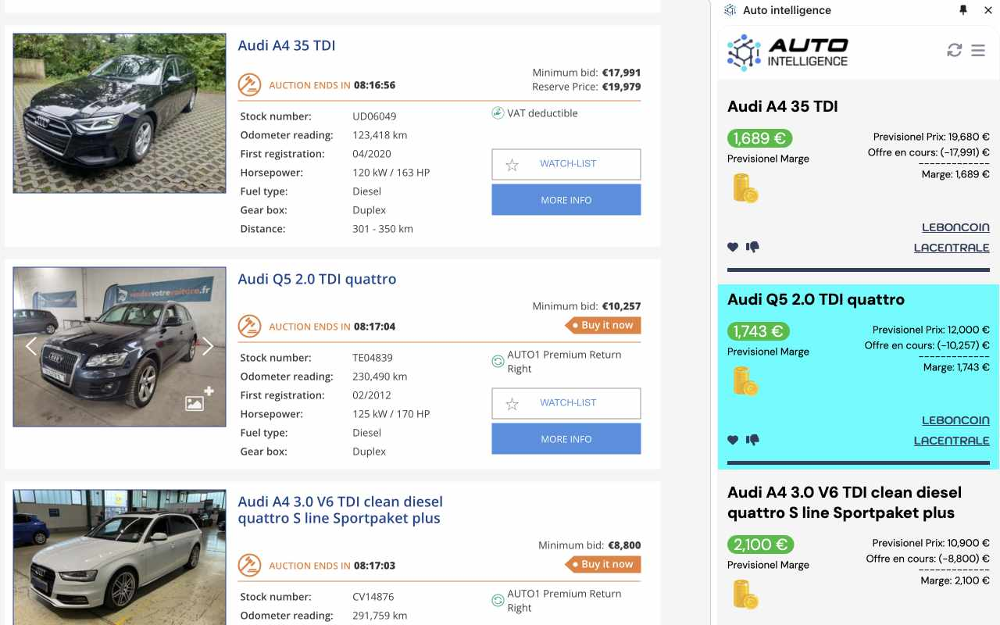
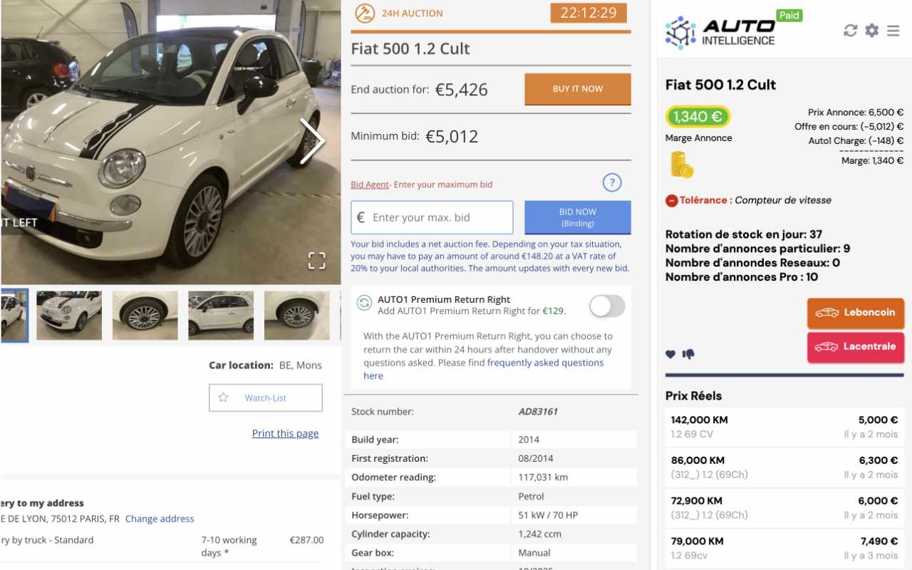

  
  
  # Auto Intelligence

### AI-Powered Chrome Extension for Vehicle Profitability Analysis

A production browser extension helping automotive professionals identify high-margin vehicles directly while browsing vehicle marketplaces.

Built with **React**, **TypeScript**, **Plasmo Framework**, and **Chrome Side Panel API**.

 

---

# 📖 Overview

Auto Intelligence is a Chrome Extension designed for automotive professionals who buy and sell vehicles through online marketplaces.

The extension integrates directly into the browsing workflow and provides real-time vehicle profitability insights while users browse platforms such as **AUTO1** and **BCAuto Enchères**.

Using a modern Chrome Side Panel interface, users can analyze vehicle opportunities without leaving the marketplace page.

The extension combines:

- Chrome Side Panel API
- Content Scripts
- Background Service Workers
- Web page parsing
- API communication
- Real-time profitability calculations

to deliver an integrated automotive intelligence solution.

---

# ✨ Features

## 🚘 Vehicle Intelligence

- Real-time vehicle profitability analysis
- Margin prediction support
- Vehicle opportunity identification
- Minimum profit configuration
- Vehicle data extraction from marketplace pages

## 🪟 Chrome Side Panel Experience

- Persistent side panel interface
- Works alongside active browser tabs
- No interruption to browsing workflow
- Faster access compared with traditional popup extensions

## 🔄 Browser Integration

- Automatic page detection
- Vehicle information extraction
- Dynamic DOM parsing
- Background processing
- Runtime message communication

## 👤 User Management

- Authentication flow
- Subscription information
- Invoice management
- User configuration
- Feedback collection

---

# 📸 Screenshots

---

## My Role

I independently designed and developed this extension from concept to deployment.

Key contributions:

- Designed extension architecture using Plasmo
- Implemented Chrome Side Panel API integration
- Developed React-based Side Panel interface
- Built Content Scripts for marketplace interaction
- Implemented AUTO1 page parsing logic
- Developed background message handlers
- Integrated backend APIs
- Implemented browser storage handling
- Built authentication and subscription flows
- Developed feedback workflows
- Optimized extension performance

---

# 🛠 Tech Stack

## Frontend

- React 18
- TypeScript
- Bootstrap
- Font Awesome

## Browser Extension

- Plasmo Framework
- Chrome Extension Manifest V3
- Chrome Side Panel API
- Content Scripts
- Background Service Worker
- Chrome Storage API

## Extension Communication

- @plasmohq/messaging
- Runtime message handlers
- Background message routing

## Backend Integration

- REST API
- Auto Intelligence API

## Development

- TypeScript
- Prettier
- npm

## Technical Highlights

## Chrome Side Panel API

Implemented a persistent browser side panel experience that allows users to access intelligence tools while continuing their workflow.

---

## Content Script Integration

Built content scripts to interact with AUTO1 marketplace pages and extract relevant vehicle information.

---

## DOM Parsing

Implemented marketplace-specific parsers to process dynamically generated vehicle information.

---

## Background Service Worker

Created background message handlers responsible for:

- Fetching prediction data
- Opening side panel
- Managing communication
- Handling API requests
- Refreshing vehicle analysis

---

## Plasmo Messaging

Used `@plasmohq/messaging` for structured communication between:

- Content scripts
- Background service worker
- Side panel UI

---

# 📚 What I Learned

This project strengthened my experience in:

- Browser Extension Development
- Chrome APIs
- React Architecture
- TypeScript
- DOM Manipulation
- API Integration
- Frontend Architecture
- SaaS Product Development
- Real-Time Data Processing

---

## Links

- 🔗 [Chrome Web Store Listing](https://chromewebstore.google.com/detail/auto-intelligence/kocjpgaikpgiclllifenngignlmhebdi)
- 👤 [My GitHub](https://github.com/gypsicoder)
- 🔗 [My LinkedIn](https://www.linkedin.com/in/bishnu-pada-chanda)